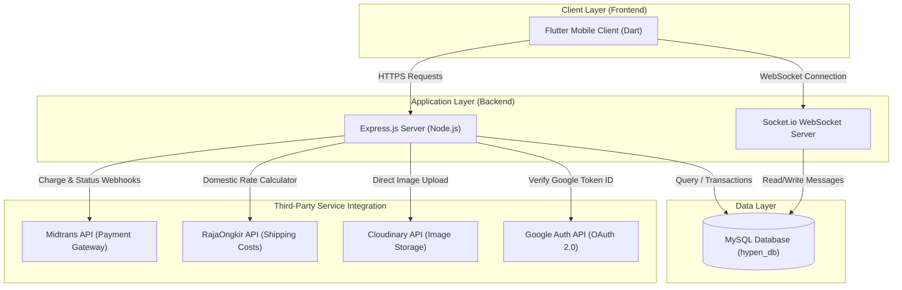
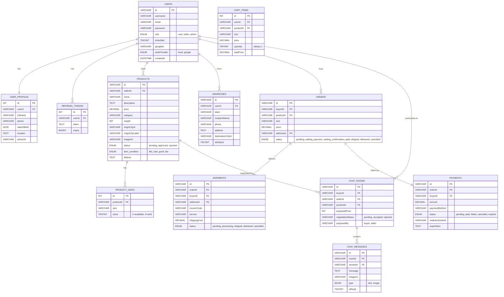
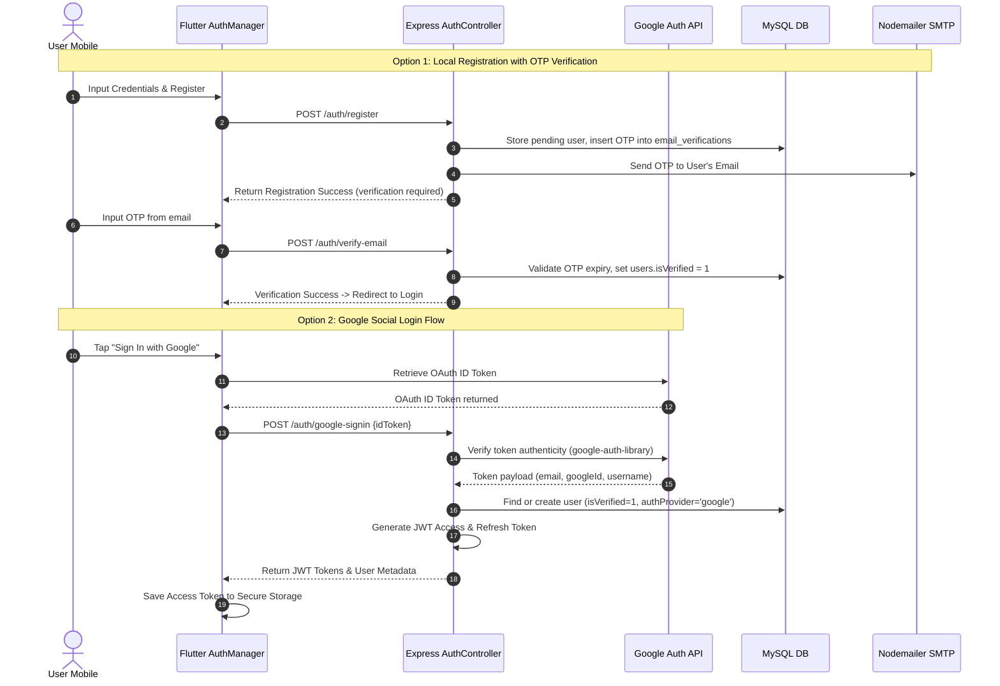
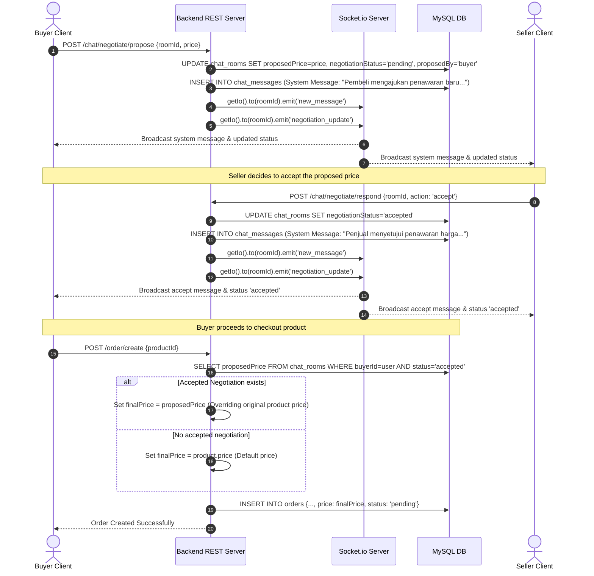
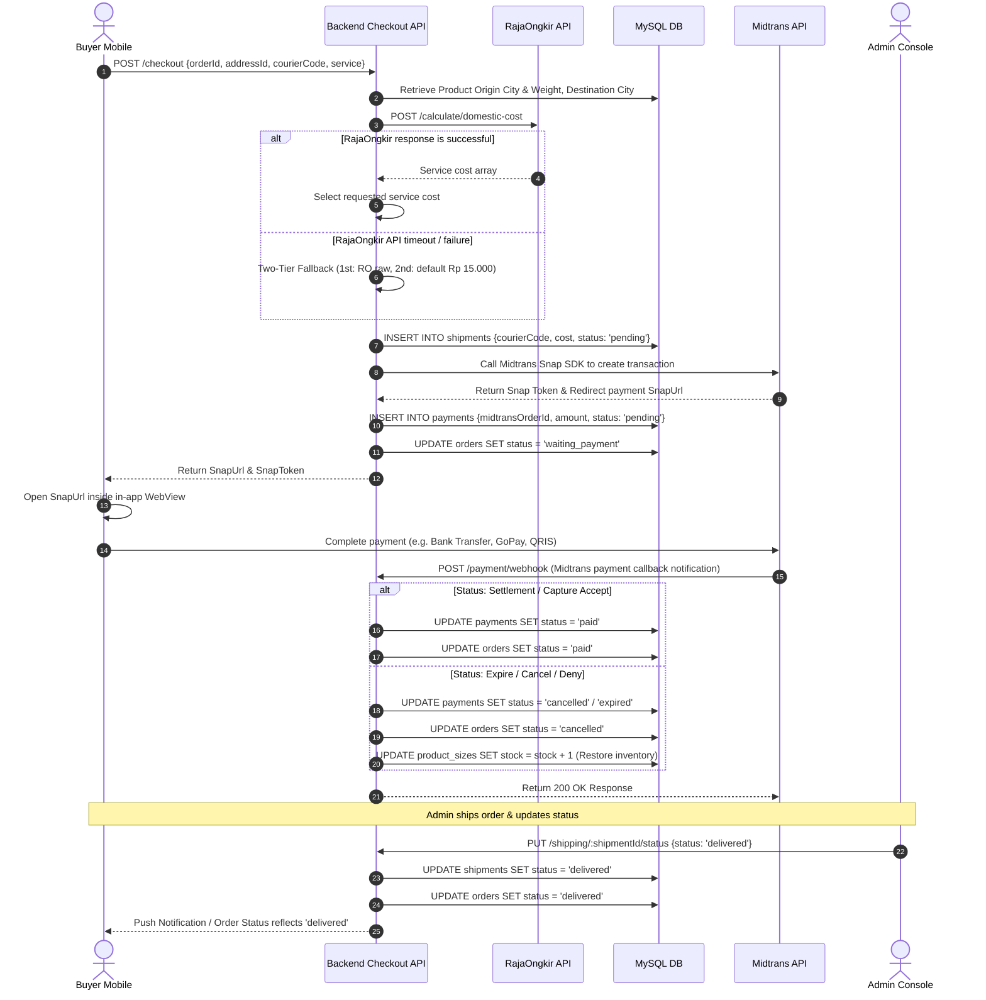
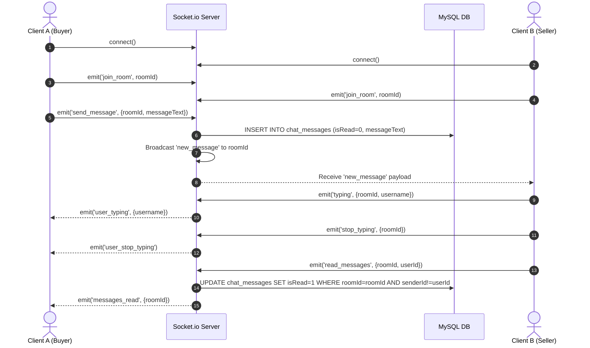

# HYPEN E-Commerce Project: Architecture & Data Flow Documentation

This document provides a professional, deep-dive technical overview of the **HYPEN** full-stack e-commerce ecosystem. HYPEN is a secondhand goods and apparel marketplace featuring real-time chat, a peer-to-peer price bargaining (negotiation) engine, automated shipping calculation, and secure transaction workflows.

---

## 1. System Architecture Overview

HYPEN is built using a decoupled client-server architecture. The backend serves as a stateless REST API and WebSocket gateway, and the frontend is a multi-platform Flutter mobile application.

---

## 2. Technology Stack

### Backend Core
* **Runtime & Framework**: Node.js & Express.js (v5.2+)
* **Database Driver**: `mysql2/promise` (connection pooling with max 10 concurrent connections)
* **Real-time Engine**: `socket.io` (v4.8+) for real-time messaging, typing indicators, and read confirmations
* **Security & Auth**: `bcrypt` (password hashing) and `jsonwebtoken` (v9.0+) for stateless JWT sessions
* **Media Hosting**: `cloudinary` SDK for product and profile image cloud storage
* **Third-Party Integrations**:
  * **Midtrans Snap SDK**: Secure payment link generation and payment callback handler
  * **RajaOngkir API**: Domestic city destination searching and weight-based rate calculation
  * **Nodemailer**: SMTP provider integrations for OTP emails
* **API Documentation**: `swagger-ui-express` (Swagger Spec v2.0 in `swagger.json`)

### Frontend Core
* **Core SDK**: Flutter & Dart (SDK ^3.10.8)
* **Networking Client**: `dio` (v5.9.2) - customized with request interceptors for automatic JWT injection and response interceptors for immediate `401 Unauthorized` token invalidation and auto-logout
* **Secure Storage**: `flutter_secure_storage` for local keychain encryption of tokens
* **State Management**: `ChangeNotifier` with Singleton Pattern managers, decoupling widget UI states from business operations
* **Authentication Plugins**: `google_sign_in` for OAuth-based social login
* **Sockets Client**: `socket_io_client` (v2.0.3) for persistence of full-duplex socket tunnels
* **Web Views**: `webview_flutter` for rendering Midtrans Snap payment screens inline

---

## 3. Database Schema & Data Models

The MySQL schema (`hypen_db`) consists of 15 relational tables. Many relationships map cascade deletions, ensuring references remain intact when users or listings are deleted.

---

## 4. Key Business Workflows & Data Flows

### A. Authentication & Registration Lifecycle
HYPEN supports traditional registration (with 6-digit OTP verification sent via email) and Google OAuth 2.0.

---

### B. Peer-to-Peer Bargaining (Price Negotiation) Flow
Because HYPEN sells secondhand goods, buyers can bargain directly with sellers within a specific chat window.

---

### C. Checkout & Payment Flow (Midtrans & RajaOngkir Webhooks)
This flow coordinates domestic shipping cost APIs (RajaOngkir) and payment processing integrations (Midtrans).

---

### D. Real-Time Chat & Synchronization Tunnel (WebSockets)
Socket.io keeps message threads alive instantly, updating unread counts and typing indicators.

---

## 5. Security & Access Control

### JWT Authentication Protocol
1. **Access Tokens**: Short-lived JWT tokens signed using the application's unique `SECRET_KEY` config. Passed via request headers: `Authorization: Bearer <accessToken>`.
2. **Refresh Tokens**: Long-lived session hashes stored in the `refresh_tokens` database table, allowing clients to re-request new credentials without forcing the user to re-authenticate manually.
3. **Database Migration Hooks**: The application automatically inspects schemas and inserts default admin credentials (`admin123@gmail.com` / `admin123`) on bootstrap, securing password mutations using `bcrypt`.

### Role-Based Access Control Matrix

| Route Endpoint | Required Role | Description |
| :--- | :--- | :--- |
| `POST /product/create` | `user`, `seller` | Submits a product to be sold. Default status: `pending`. |
| `PUT /admin/product/:id/approve` | `admin` | Approves a listing, making it visible to public search filters. |
| `GET /admin/payments` | `admin` | Fetches payment history logs across the entire ecosystem. |
| `PUT /admin/shipping/:id/status` | `admin` | Dispatches shipments and flags order statuses to `delivered`. |
| `DELETE /chat/room/:id` | `admin` | Revokes access or purges abusive chat rooms. |

---

## 6. Frontend State & Network Architecture

### Manager Layer (Singleton State Management)
* **AuthManager**: Retains current profile variables (`role`, `isLoggedIn`, `photoUrl`). Clears caches and registers standard notification helpers upon executing `logout()`.
* **ChatManager**: Manages active connection parameters for Socket.io. Synchronously adds messages to local cache objects when receiving incoming events and triggers `markMessagesRead()` requests.
* **ProductManager / AddressManager**: Handles HTTP data caching with explicit `force` refetch triggers to reduce redundant payload sizes over mobile connections.

### Network Interceptors (Dio Service)
The `ApiClient` class acts as the centralized gateway for all API traffic:
1. **Request Interceptor**: Evaluates if a JWT token is stored inside the local Secure Storage key chain, injecting `Authorization: Bearer <token>` on matching requests automatically.
2. **Response Interceptor**: Monitors API health. If a `401 Unauthorized` token expiry response is returned, it intercepts the exception, triggers `AuthManager().logout()`, and cancels the session immediately.
3. **Connection Limits**: Imposes connection timeouts (10s) and receive timeouts (10s) to keep mobile client memory leakages minimal.
